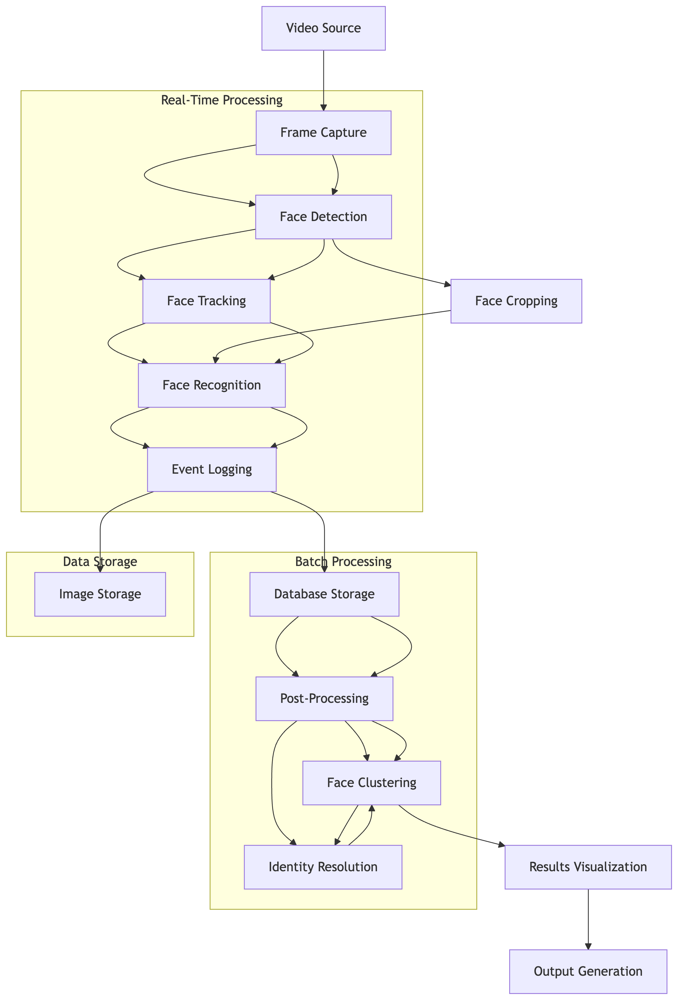

# Intelligent-Face-Tracker-with-Auto--Registration-and-Visitor-Counting
Install dependencies,Download models and setup directories:
!pip install ultralytics opencv-python-headless numpy facenet-pytorch deep-sort-realtime scikit-learn pandas matplotlib
!wget https://github.com/akanametov/yolov8-face/releases/download/v0.0.0/yolov8n-face.pt
!mkdir -p logs/entries logs/exits sample_images
pip install torch torchvision --extra-index-url https://download.pytorch.org/whl/cu117

Create virtual environment:
python -m venv face-tracker
source face-tracker/bin/activate  # Linux/Mac)
face-tracker\Scripts\activate    # Windows

Detailed Assumptions:
    Technical Assumptions:
        Face Characteristics:
        The smallest face the system can reliably detect is 20 by 20 pixels in size.
        For best results, faces should be oriented within ±30 degrees from a straight, frontal view.
        The system performs optimally when processing videos or images with a resolution of 720p (HD) or higher.
        
        Environmental Factors:
        The system expects moderate lighting conditions, specifically within a 50–1000 lux range.
        It can tolerate limited facial occlusion, with a maximum of 30% of the face covered (e.g., glasses or masks).
        Effective operation requires a background-to-face contrast ratio of at least 1.5:1, ensuring the face stands out clearly from the background.

    Functional Assumptions:
        Event Logging:
        An "Entry" event is logged the first time a face is recognized in the system.
        An "Exit" event is triggered when a previously recognized face is absent for 30 consecutive frames.
        Each tracked face must be visible for at least 5 frames to be considered a valid event.
        
        Identity Management:
        Two faces are treated as distinct identities if their similarity score is below 55%.
        For a face to be validated as a known identity, there must be at least 2 samples in its cluster.
        The maximum allowed variation within a cluster (for identity consistency) is governed by a DBSCAN epsilon of 0.5.
        
        Data Handling:
        All face data is stored locally, with no cloud uploads to maintain privacy and offline functionality.
        Temporary data is automatically cleaned up after the session ends (especially in environments like Google Colab).
        A local SQLite database is used for storing persistent identity and tracking information.
        
        Video Input:
        The system supports multiple video input formats including MP4, AVI, MOV, and RTSP streams.
        The ideal input frame rate is between 15 and 30 FPS for stable real-time processing.
        It supports input up to 4K resolution, but frames are downscaled to 1080p internally for efficient processing.

Configuration Specification:
   config.json Structure:
   {
  "detection": {
    "interval": 1,
    "min_confidence": 0.25,
    "min_face_size": 20,
    "expand_ratio": 0.15
  },
  "recognition": {
    "threshold": 0.55,
    "embedding_size": 512
  },
  "tracking": {
    "max_age": 30,
    "n_init": 3,
    "matching_threshold": 0.7
  },
  "clustering": {
    "eps": 0.5,
    "min_samples": 2,
    "metric": "euclidean"
  },
  "logging": {
    "directory": "logs",
    "retention_days": 7,
    "image_quality": 85
  },
  "database": {
    "path": "faces.db",
    "backup_interval": 3600
  },
  "input": {
    "source_type": "video",
    "source": "https://github.com/intel-iot-devkit/sample-videos/raw/master/face-demographics-walking.mp4",
    "max_frames": 300,
    "resolution": "auto"
  },
  "output": {
    "display_frames": 30,
    "sample_size": 10,
    "visualization": true
  }
}

Configuration Parameters Explained:

      Detection Section:
            These parameters control how the system detects faces in video frames:
            interval (Default: 1, Range: 1–10):
            This specifies how often to process frames. A value of 1 means every frame is processed. A value of 2 means every second frame is processed, and so on.
            min_confidence (Default: 0.25, Range: 0.01–0.99):
            This sets the minimum confidence score required for a face detection to be considered valid. Lowering this value makes the system more permissive, while increasing it makes it more selective.
            min_face_size (Default: 20, Range: 10–100):
            Sets the minimum width or height (in pixels) of a face to be detected. Smaller values allow detection of smaller faces.
            expand_ratio (Default: 0.15, Range: 0.05–0.3):
            Defines how much to expand the detected face bounding box to include extra margin. Useful for ensuring full facial features are captured.

      Recognition Section:
            These parameters govern how the system matches faces using facial features:
            threshold (Default: 0.55, Range: 0.3–0.8):
            The similarity threshold for recognizing faces. A lower value allows for looser matching; a higher value enforces stricter matching.
            embedding_size (Default: 512, Fixed):
            This defines the dimensionality of the face embedding (feature vector). It is a fixed value and determines how faces are represented for comparison.

      Tracking Section:
            These parameters determine how detected faces are tracked across multiple frames:
            max_age (Default: 30, Range: 10–100):
            The number of frames a face can remain undetected before the tracker removes it. Higher values allow longer gaps between detections.
            n_init (Default: 3, Range: 1–10):
            Specifies how many consecutive detections are needed before a new face is considered a valid track.
            matching_threshold (Default: 0.7, Range: 0.5–0.95):
            This sets the threshold for comparing appearance features when associating new detections with existing tracks. Lower values mean more strict matching.

      Clustering Section:
            These parameters control how recognized faces are grouped together.
            eps (Default: 0.5, Range: 0.3–1.0):
            The maximum distance allowed between two points to be considered part of the same cluster. Lower values create tighter clusters.
            min_samples (Default: 2, Range: 1–5):
            The minimum number of samples required to form a valid cluster. Lower values allow smaller clusters to be formed.
            metric (Default: euclidean):
            The distance measurement method used for clustering. Typically set to euclidean to measure straight-line distance in the feature space.

    Input Section:
            These parameters specify how the system receives video input:
            source_type (Default: video, Options: video / rtsp):
            Defines the type of input source. Can be a video file or an RTSP stream (real-time network feed).

  source (Default: URL):
            The actual path or URL to the input video or stream.
            max_frames (Default: 300, Range: 1 to ∞):
            Limits how many frames to process, typically to avoid overloading resources, especially in cloud environments like Google Colab.
            resolution (Default: auto, Options: HD / FHD / 4K):
            Sets the resolution for processing video frames. auto uses the original resolution; other options can downsample for speed or quality trade-offs.

